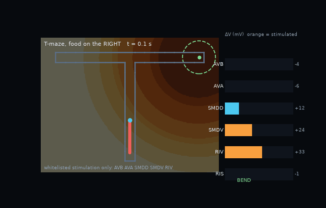

# worm-whisperer

**What a fixed connectome can and cannot do** — a whole-body *C. elegans* simulator in which a learning agent may stimulate only a whitelist of interneurons. The 302-neuron wiring, the motor layer and the body do the rest.



*한국어 README: [README.ko.md](README.ko.md)*

**Live demo (recorded simulations, mazes, neuron readouts): [kairess.github.io/worm-whisperer](https://kairess.github.io/worm-whisperer/)**

## The question

Take the OpenWorm c302 connectome (302 neurons, chemical synapses and gap junctions from the published wiring), never change a single connection, and ask: **which behaviours can be produced through this wiring, and which cannot?** Instead of driving muscles, the agent (an evolution-strategy policy) injects current into a short whitelist of sensory, command and steering interneurons, exactly as an optogenetics experimenter could. Everything downstream is fixed: the connectome dynamics, a literature motor layer (Boyle, Berri & Cohen 2012), and a 2D viscoelastic body crawling on agar, with walls.

Every hypothesis was pre-registered with its judgement criterion before training (`docs/PLAN_WORMGYM.md`), and every negative result is kept.

## Main results (pre-registered, n = 128–256 random starts)

| Question | Verdict | Key number |
|---|---|---|
| Can the wiring do chemotaxis when only command/steering interneurons (AVB, AVA, SMDD, SMDV, RIV) are stimulated? | ✓ (4 of 5 seeds) | reach 0.914 within 40 s at 2.5 mm; random 0.04. Seeds 0–4: 0.914 / 0.973 / 0.301 / 0.969 / 0.934 (mean 0.82 ± 0.29); seed 2 learned the reversal rule but never used the deep bend |
| … when only sensory neurons (ASE, AWC, AWA, ASK, ASH, PLM, ALM, AVM) are stimulated? | ✗ | 0.109 ≈ chance 0.125 — the sensory→command step is silent in this model (also with static stimulation) |
| Does learning rediscover the pirouette rule? | ✓ (rule) / △ (sufficiency) | falling C → reverse + omega, rising → run (ρ = −1.00 in 2 of 3 seeds); reversal-onset rate falls monotonically with dC/dt as in Pierce-Shimomura 1999. Reversal + omega alone: 2 seeds fail (0.05–0.11), 1 seed finds a bend-always strategy that reaches 0.328 at 2.5 mm (full circuit 0.914) |
| What is the minimal circuit? | | reversal (AVA) + deep bend (RIV) + steering (SMD): ablating any one drops the trained policy to 0.07–0.27; retraining without RIV fails (0.19), without SMD reaches at most 0.33 |
| Is a sleep neuron (RIS) needed to stop? | ✗ | never used; the agent stops by withdrawing command drive |
| Does the actual wiring matter when command neurons are stimulated directly? | ✓ | shuffled wiring (same weights, counts and signs): 0.14 / 0.15 / 0.32 after retraining (3 seeds), 0.02–0.06 for the transferred policy, vs 0.871 for the real wiring — deep-bend pulses rarely fire in shuffled networks. **Layer dissociation:** shuffling only chemical synapses changes nothing (0.859 retrained, 0.914 transferred); shuffling only gap junctions collapses it (0.078 / 0.125). In these fitted dynamics the stimulus reaches the readout neurons through the gap-junction layer |
| How are corners taken in a corridor four body-widths wide? | | only by a deep bend pressed against the wall; head steering alone 0/32. **The bend's dorsal/ventral direction is the turn direction.** |
| Ventral-only bends (the default omega turn)? | | T-maze: enters the left arm 128/128; right-turn corridor 0/32; 3×3 grid unsolvable |
| Let SMDD/SMDV set the bend direction (as reported in real worms)? | ✓ (ADR-017) | right-turn corridor becomes learnable (1.00) — but the policy becomes one-handed; robust across corridor widths 0.25–0.35 mm |
| Can the worm pick the correct arm at a T-junction? | | With temporal sensing only: impossible in principle (both arms smell the same at the junction) → the learned strategy is *go left first, reverse if it gets worse* (reach 1.00, right goal costs 7–38 s). With a left/right concentration difference: bend direction follows the source in 73 % of pulses (62 % without) |
| Why does a correctly aimed right entry still abort? | | a wall stall reads as "concentration stopped rising" and triggers the reverse + ventral-bend reflex — the same reflex that takes corners. Gating it off removes cornering entirely |

**Testable predictions for real animals.** In narrow T-mazes, arm choice should be decided by the dorsal/ventral direction of the deep bend executed at the junction; conditions that suppress dorsal turns should bias animals toward the ventral arm and delay reaching the other goal; wall stalls should trigger pirouettes. Real worms show no innate side bias (Gourgou et al. 2021, DI = 0.03) and choose the dorsal/ventral turn by the gradient (Nature Neurosci. 2026) — in the model this requires both dorsal bends and lateral sensing.

**Honest limits.** The motor layer, steering and the deep-bend rules are literature-based assumptions outside the connectome (ADR-012/013/016/017). The body has no wall-pushing propulsion (Park et al. 2008), so it crawls slowly in corridors. There is no dorsal/ventral cost asymmetry, so the model cannot explain the real ventral preference. One learning algorithm (ES) and one small policy. The 3×3 grid has no robust solution.

## How it works

```
 observation ──► policy (MLP, 16 hidden) ──► stimulus amplitudes for whitelisted neurons (0–6 pA, every 0.5 s)
 (log odour change, wall touch, …)          AVB AVA SMDD SMDV RIV  (never motor neurons or muscles)

 stimulus ──► c302 C2 network in JAX (302 neurons, wiring fixed, fitted dynamics "Vfit")
          ──► membrane potentials of AVB / AVA / SMD / RIV / RIS read out
          ──► Boyle 2012 bistable motor layer: forward/backward gates, head steering, deep-bend pulse
          ──► 2D viscoelastic rod on agar with wall contact ──► trajectory, odour, reward
```

Headline reach rates and arm choices were re-checked at the fine integration step (dt 0.05 ms, float64) on the same starts and are unchanged; maze transit times are 25 % longer at the fine step (`docs/PAPER_OUTLINE.md` §7, E8). Training uses OpenAI-ES on a GPU batch simulator (`worm/env/batch.py`, hundreds of worms per rollout, ~6 episodes/s at B = 256). Evaluation is always a fresh set of 128–256 random starts on the pre-registered protocol.

## Quick start

Requirements: [uv](https://docs.astral.sh/uv/), Python 3.12 (downloaded by uv), optionally an NVIDIA GPU. The c302 reference network (`runs/phase0/…`, ~650 MB, not in git) is needed for everything; copy `runs/` from another machine or regenerate it (needs Java and a C compiler, see `docs/SESSION_LOG.md` §5).

```bash
uv sync
uv run pytest -q tests                                   # 21 tests, ~30 s (CPU)

# chemotaxis with command/steering channels (curriculum: 1.5 mm then 2.5 mm)
uv run python experiments/wormgym_es.py --src_dist 1.5 --pop 32 --ep_per 8 --gens 40 --out runs/wormgym/near
uv run python experiments/wormgym_es.py --src_dist 2.5 --init runs/wormgym/near/theta.npy --gens 100 --out runs/wormgym/far
uv run python experiments/wormgym_es.py --eval runs/wormgym/far/theta.npy --episodes 256      # reach rate, n=256

# mazes (walls, touch observations, dorsal/ventral bend rule)
uv run python experiments/wormgym_es.py --maze tmaze --touch --omega_smd_dir --episode_s 120 --init runs/wormgym/far/theta.npy --gens 40 --out runs/wormgym/tmaze
uv run python experiments/wormgym_maze_analyze.py runs/wormgym/tmaze/theta.npy --maze tmaze --touch --omega_smd_dir
```

Platform notes (Linux GPU vs macOS Intel, thread limits for CPU workers, GPU preallocation) are in `docs/SESSION_LOG.md` §3c–3d and `README.ko.md`.

## Part 1 (earlier work): natural-language commands as a virtual experimenter

Before the learning agent, the same simulator was driven by a small translator: a sentence embedding (MiniLM) → a mixture over 13 literature-backed stimulation protocols → whitelisted currents.

```
"go forward"     → AVB command interneurons          → crawling at 0.18 mm/s, 0.56 Hz
"turn left"      → AVB + SMDV                        → +52° in 12 s
"make a U-turn"  → AVA → RIV/SMDV omega turn → AVB   → +174° reorientation
"watching YouTube" → RIS sleep-active neuron         → locomotion stops (quiescent 78 %)
```

Held-out phrase accuracy 0.86; 26/26 commands reach the intended movement axis. Sensory protocols (touch, aversive, chemotaxis) do not work, for the reason found above. Run it with:

```bash
uv run python experiments/phase4_train_translator.py
uv run uvicorn worm.server.app:app --port 8000        # http://localhost:8000
```

Details: `docs/RESULTS_PHASE3_4.md`, `docs/COMMANDS.md`.

## Repository layout

```
worm/neural/     connectome.py (NeuroML parser), jaxsim.py (C2 simulator), variants.py (V0/V1/Vfit, θ, wiring-shuffle control)
worm/body/       rod2d.py (2D rod + walls), boyle_motor.py, motor_block.py (JAX block), muscle_map.py
worm/sim.py      neural–body coupling (Worm), gates, steering, deep-bend pulse
worm/env/        gym.py (numpy env), batch.py (GPU batch env), mazes.py, chem.py
worm/llm/        protocols.py (whitelist), phrases.py, translator.py      worm/server/  web UI
experiments/     wormgym_*.py (ES, analyses, oracle, exporter); phase0–4 scripts of Part 1
tests/           21 tests    docs/  results, decisions (ADR-001…017), plans (Korean)    docs/index.html  demo page
runs/            outputs, not in git
```

## Documentation (Korean)

| Document | Content |
|---|---|
| [docs/PLAN_WORMGYM.md](docs/PLAN_WORMGYM.md) | Worm Gym: pre-registered hypotheses H1–H5-9, all verdicts, mechanisms, literature comparison |
| [docs/PAPER_OUTLINE.md](docs/PAPER_OUTLINE.md) | Paper claims, figures, pre-registered evidence experiments E1–E9 with verdicts and 95 % CIs |
| [docs/DECISIONS.md](docs/DECISIONS.md) | ADR-001 … ADR-017 |
| [docs/RESULTS_PHASE1.md](docs/RESULTS_PHASE1.md) | JAX re-implementation, signal-propagation atlas, inhibition (negative) |
| [docs/RESULTS_PHASE2.md](docs/RESULTS_PHASE2.md) | Body coupling, search for an oscillator (negative) |
| [docs/RESULTS_PHASE3_4.md](docs/RESULTS_PHASE3_4.md) | Protocols, steering / U-turn, translator, UI |
| [docs/SESSION_LOG.md](docs/SESSION_LOG.md) | Work log and how to continue on another machine |
| [docs/REFERENCES.md](docs/REFERENCES.md) | Papers, tools, datasets |

## Key references

- Gleeson et al. 2018, *c302* (the neuron model and connectome). Randi et al. 2023, *Neural signal propagation atlas of C. elegans*, Nature.
- Boyle, Berri & Cohen 2012 (motor layer). Chalfie et al. 1985; Gray, Hill & Bargmann 2005; Turek et al. 2016 (protocols).
- Pierce-Shimomura, Morse & Lockery 1999 (pirouettes). Gourgou et al. 2021, iScience (T-maze). *Neural sequences underlying directed turning in C. elegans*, Nature Neurosci. 2026 (dorsal/ventral turn control). Park et al. 2008, PLoS ONE (locomotion in structured environments).

## Status

Part 1 closed 2026-09-03; Worm Gym and maze navigation 2026-09-03…06. Pre-registered evidence experiments E1–E9 are complete (junction mechanism, seed replication of the rule and of the headline reach rate, width sensitivity, literature comparison, wiring-shuffle controls including the chemical/gap-junction layer dissociation, integration-step re-check, episode-level statistics); see `docs/PAPER_OUTLINE.md` §3, §6 and §7. Developed with Claude Code; session transcripts in `history/`.
